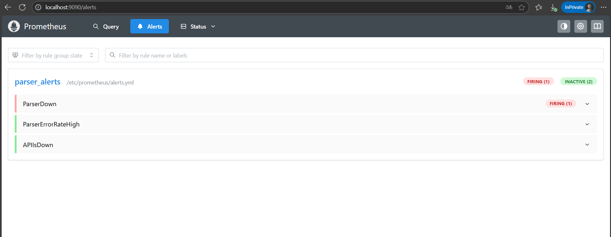
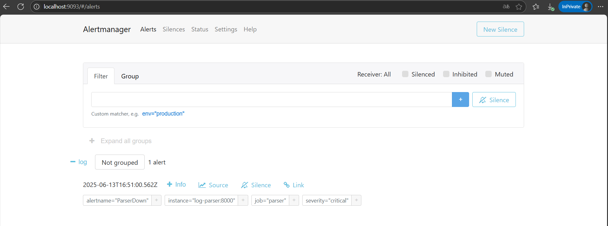
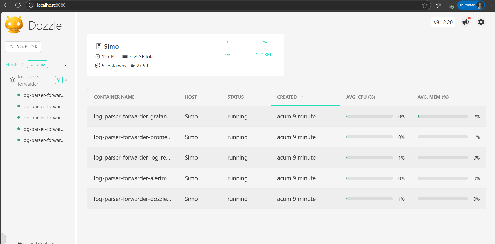

# Log Parser Forwarder

This project showcases a simple log collection pipeline suitable for practicing DevOps concepts. It contains two services managed with Docker Compose:

* **log-receiver-api** – a small Node.js server that accepts log batches over HTTP and appends them to a file.
* **log-parser** – a Python script that reads a log file, filters only `ERROR` and `CRITICAL` lines, batches them and forwards the batches to the API.

Additional containers provide observability:
* **dozzle** – a lightweight web UI to view container logs.
* **Prometheus**, **Grafana** and **Alertmanager** – collect metrics and raise alerts for the services.

The repository also contains Ansible playbooks and Terraform configurations that can deploy the stack on a remote host.

## Requirements

- Docker and Docker Compose
- (optional) Ansible if you want to deploy remotely
- (optional) Terraform for provisioning cloud resources

## Running locally

Build and start all services using Docker Compose:

```bash
docker compose up --build
```

The API will listen on `http://localhost:3000`. Dozzle is available on `http://localhost:8080`, Prometheus on `http://localhost:9090`, Grafana on `http://localhost:3001`, and Alertmanager on `http://localhost:9093`.

A sample log file is included in `parser/sample.log`. The parser container runs the script periodically and sends filtered lines to the API. Parsed logs are persisted under the `logs/` directory on the host.

## Monitoring stack

Prometheus scrapes metrics from both services. Grafana provides dashboards, while Alertmanager handles alert routing. Configuration files reside under `monitoring/` and are mounted into the containers. Set the `GRAFANA_ADMIN_PASSWORD` environment variable when starting the stack to control Grafana access.

## Deploying with Ansible

The `ansible/` directory contains a basic playbook that can build the Docker images and run the Compose stack on a remote host. You need to configure the inventory and SSH credentials before running:

```bash
ansible-playbook ansible/deploy.yml -i ansible/inventory
```

This makes it easy to spin up the environment on a cloud VM, such as an AWS EC2 instance.

## Deploying with Terraform

Terraform definitions are provided under the `terraform/` directory. The `projectAWS` configuration provisions an EC2 instance, while `projectAzure` spins up a VM on Microsoft Azure. 

To create the infrastructure:

```bash
cd terraform/projectAWS  # or terraform/projectAzure
terraform init
terraform apply
```

The public IP address will be printed as an output when the apply step completes. A minimal example is also available under `terraform/project_minimalisticAWS` for experimentation.

## Project goals

This project was built for learning purposes and demonstrates how Docker, basic CI checks and simple automation fit together. Feel free to adapt it further or integrate additional DevOps tooling.

## 📸 Screenshots

### ✅ Active alert in Prometheus


### 🔔 Alert handled by AlertManager


### 🧾 Container monitorization with Dozzle


## Contributing
We welcome contributions! Please see [CONTRIBUTING.md](CONTRIBUTING.md) for guidelines.

## Code of Conduct
Participating in this project means adhering to our [Code of Conduct](CODE_OF_CONDUCT.md).

## License
This software is available under the [Apache 2.0](LICENSE) license.

